<a href="https://alifayed.com">
  <picture>
    <source media="(prefers-color-scheme: dark)" srcset="./assets/animated-logo-dark.svg" />
    <source media="(prefers-color-scheme: light)" srcset="./assets/animated-logo-light.svg" />
    
  </picture>
</a>

# Hi, I'm Ali Fayed

I'm focused on building accessible and fast digital experiences using modern technologies.

[Portfolio](https://alifayed.com)

---

## Hi, I'm Ali.

I'm a front-end developer with 5+ years of experience turning ideas into responsive, accessible web experiences. I bring design and development together, with a focus on clear interfaces, reusable components, and performance.

I enjoy making complex experiences feel simple—and paying attention to the details that make a website feel polished.

## Technologies & Tools

### 💻 Languages

### ⚛️ Front End

### ⚙️ CMS & APIs

### 🛠️ Development & Design

## 📊 GitHub Activity

<picture>
  <source media="(prefers-color-scheme: dark)" srcset="./assets/stats-dark.svg" />
  <source media="(prefers-color-scheme: light)" srcset="./assets/stats-light.svg" />
  
</picture>

<picture>
  <source media="(prefers-color-scheme: dark)" srcset="./assets/streak-dark.svg" />
  <source media="(prefers-color-scheme: light)" srcset="./assets/streak-light.svg" />
  
</picture>

<picture>
  <source media="(prefers-color-scheme: dark)" srcset="./assets/languages-dark.svg" />
  <source media="(prefers-color-scheme: light)" srcset="./assets/languages-light.svg" />
  
</picture>

*Language breakdown reflects public repository code, rather than my complete professional toolkit.*

### A year of contributions, in motion

<picture>
  <source media="(prefers-color-scheme: dark)" srcset="./assets/snake-dark.svg" />
  <source media="(prefers-color-scheme: light)" srcset="./assets/snake-light.svg" />
  
</picture>

## How I work

- Translate designs into responsive, accessible interfaces.
- Build reusable components and practical content workflows.
- Take ownership from implementation through launch and ongoing improvements.

---

**Good design deserves great implementation.**

[Explore my portfolio →](https://alifayed.com)

